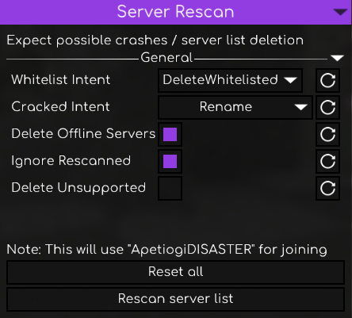

<h1>Manual rescan for Re-ServerSeeker scanned list</h1>
<h4>Created, since the current API has that temporarily disabled 
Only supports versions 1.8 - 1.21.4
</h4>  

### How to install the extension
1. Install **[Node.js](https://nodejs.org/en/download)** if you don't have it already.
2. Create a folder named **Re-Scanner** inside of your Minecraft directory. 
Example path: `C:\Users\Username\AppData\Roaming\.minecraft\Re-Scanner`
3. Install the prebuilt **[index.js](https://github.com/I-MSV/Re-Scanner/releases)** and move it inside the **Re-Scanner** folder.
4. If you've done everything correctly, a new button should appear in your **Re:ServerSeeker** tab.  

  
